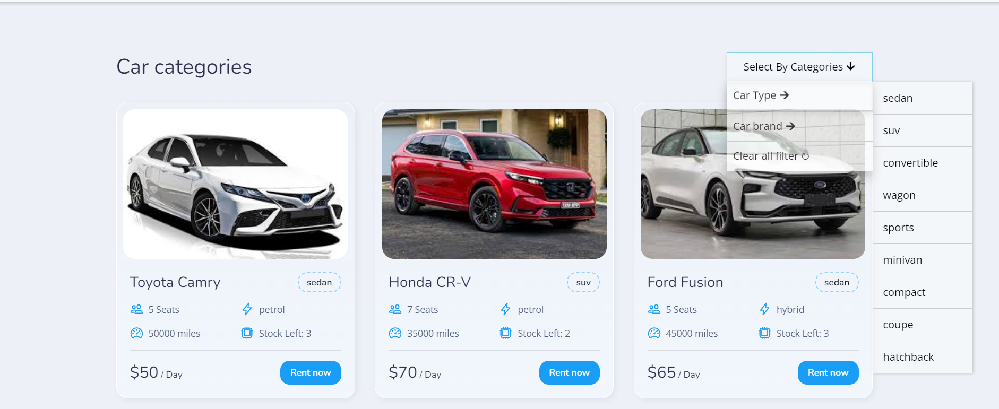
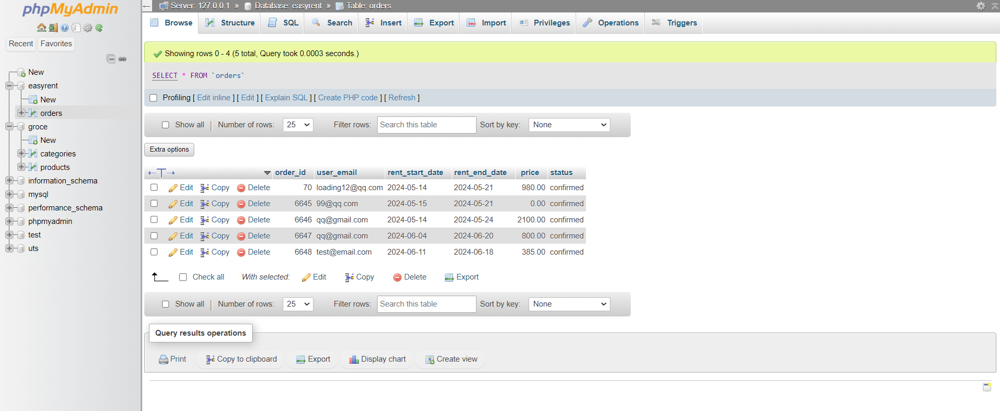
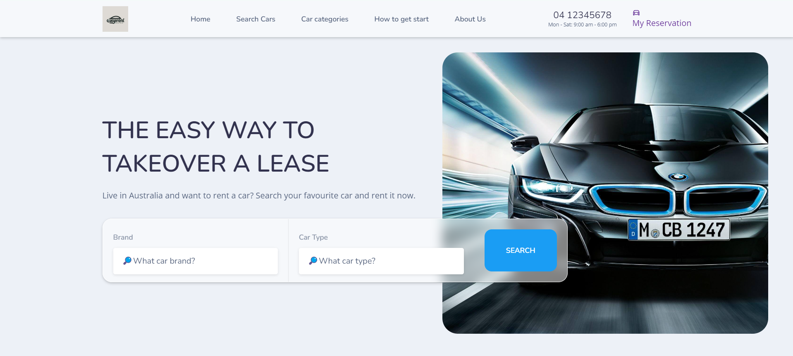
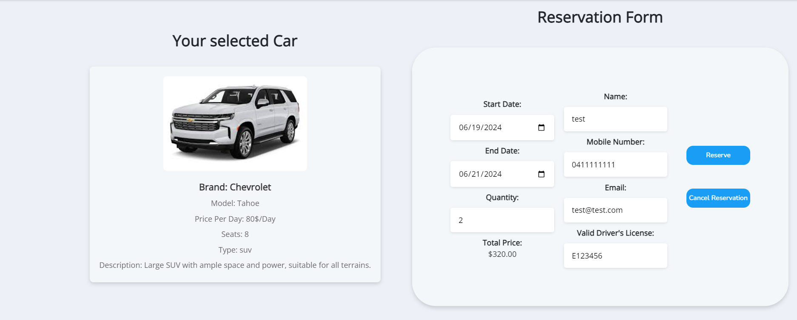
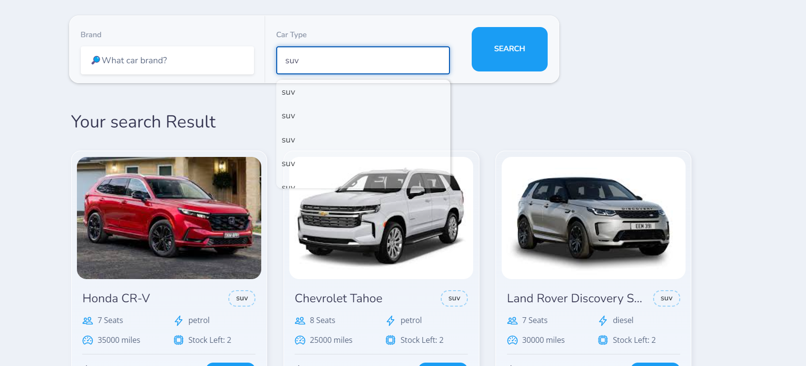

# EasyRent

This is a project for an online car rental system. It is a project for a school assignment.

## Table of Contents

- [EasyRent](#easyrent)
  - [Table of Contents](#table-of-contents)
  - [Introduction](#introduction)
  - [Requirements](#requirements)
  - [Installation](#installation)
  - [Database](#database)
  - [Data Structures](#data-structures)
  - [Visual Components](#visual-components)
    - [Website Logo](#website-logo)
    - [Search Box](#search-box)
    - [Car Categories](#car-categories)
    - [Car Grid View](#car-grid-view)
    - [Reservation](#reservation)
    - [Order Confirmation](#order-confirmation)
  - [User Story](#user-story)
  - [License](#license)
  - [Demo](#demo)
  - [Authors](#authors)
  - [Show your support](#show-your-support)
  - [Screenshots](#screenshots)
    - [Categories Page](#categories-page)
    - [Database Structure](#database-structure)
    - [Home Page](#home-page)
    - [Order Page](#order-page)
    - [Reservation Page](#reservation-page)
    - [Search Page](#search-page)

## Introduction

- This is an online car rental system project.
- The purpose of this project is to create a streamlined online car renting experience.
- The website will have features like browsing cars by type or brand, searching for cars, checking availability, making rental requests, and order confirmations.

## Requirements

- XAMPP is required to run the project.
- The project will be hosted on a localhost server.
- Use HTML, CSS, JavaScript, AJAX, PHP, JSON, MySQL, Localstorage, and Session.

## Installation

- Install XAMPP.
- Open XAMPP and click on the Start button.
- Clone the project to the root of the XAMPP server.
- Open the project in XAMPP.
- Import the SQL file from the database folder to the XAMPP server.
- Open Browser and navigate to [localhost:8080](localhost:8080).
- Hurray! The project is now running.

## Database

- The database is stored in a folder called `database`.
- The database is named `easyrent.sql`.
- The database is stored in the root of the XAMPP server.
- The database is imported to the XAMPP server.
- Database used is MySQL.
- Database Connection page is named `database.php`.

## Data Structures

- Design a JSON file `car.json` to store information about cars.
- There should be at least 30 cars in the JSON file.
- Each car should have at least 10 attributes including type, brand, model, image, mileage, fuel type, seats, quantity, price per day, and description.
- The availability status should show as either ‘Yes’ or ‘No’.

## Visual Components

### Website Logo

- There should be a logo for the website appearing on all pages.

### Search Box

- There should be a search box allowing users to look up cars using keywords.

### Car Categories

- Cars should be categorized by type (e.g., Sedan, Wagon, SUV) and brand (e.g., Ford, Mazda, BMW).
- Users can click a category to view all the cars in that category.

### Car Grid View

- Multiple cars should be aligned in a grid view.
- Each car should show key information like model, image, price per day, and availability.
- Each car should have a "rent" button for making reservations.

### Reservation

- Users can view and edit their reservation details.
- Users can cancel, proceed to place an order, or leave the reservation page.
- Users must provide name, mobile number, email address, and a valid driver’s license to place an order.

### Order Confirmation

- Once an order is placed, a web link for confirmation is shown.
- The order is not placed until the user clicks the confirmation link.

## User Story

- As a user, I want to be able to search for a car.
- As a user, I want to be able to see the available cars.
- As a user, I want to be able to reserve a car.
- As a user, I want to be able to confirm my rental order.
- As a user, I want to provide feedback to the car rental website.

## License

[MIT](https://choosealicense.com/licenses/mit/) © [ZEYU](https://github.com/yourusername)

- This project is licensed under the MIT License - see the [LICENSE](LICENSE) file for details.

## Demo

- [Video Demo](https://utsmeet.zoom.us/rec/share/3yN8UtQDkBidlS5XP1haX2ydDLKvQg47U-LFSvrfdNN5RSDQOxSwzMjQ3EGbIYOh.wsCad8SbOD4kdNO3?startTime=1718675921000) (Passcode: 2xaa9r#Q)

## Authors

- [ZEYU CUI](https://github.com/zeyucui1)

## Show your support

Give a ⭐️ if this project helped you!

## Screenshots

### Categories Page

### Database Structure

### Home Page

### Order Page

### Reservation Page

### Search Page

